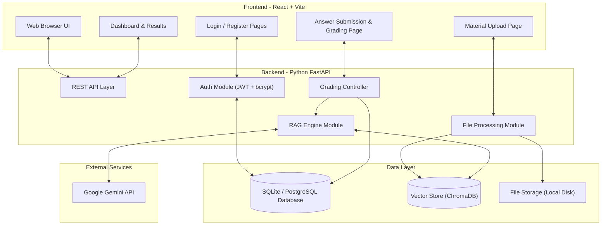
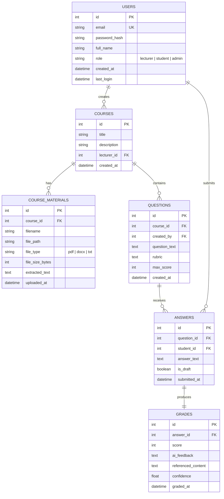

# System Architecture & Database Design — AI-Grader Pro

**Version:** 1.0 | **Date:** May 7, 2026

---

## 1. System Architecture

### High-Level Architecture



### Technology Stack Rationale

| Layer | Technology | Why This Choice |
|-------|-----------|----------------|
| Frontend | React + Vite | Component-based, fast dev server, industry standard |
| Backend | Python FastAPI | Async support, auto API docs, easy AI library integration |
| Auth | JWT + bcrypt | Stateless tokens, secure password hashing, no session server needed |
| Database | SQLite (dev) / PostgreSQL (prod) | SQLite is zero-config for development; PostgreSQL for production scale |
| Vector Store | ChromaDB | Free, local, Python-native, perfect for RAG pipelines |
| AI API | Google Gemini | Free tier available, excellent quality, good documentation |
| File Parsing | PyPDF2 + python-docx | Mature libraries, handles common academic document formats |
| Embedding | Gemini Embedding API | Consistent ecosystem with the grading API |

---

## 2. Backend Module Structure

```
backend/
├── main.py                  # FastAPI app entry point
├── config.py                # Environment variables and settings
├── requirements.txt         # Python dependencies
├── models/
│   ├── user.py              # User ORM model
│   ├── course_material.py   # Material metadata model
│   ├── question.py          # Question model
│   ├── answer.py            # Student answer model
│   └── grade.py             # Grade/result model
├── routers/
│   ├── auth.py              # Login, register, token endpoints
│   ├── materials.py         # Upload, list, delete materials
│   ├── questions.py         # CRUD for questions
│   ├── grading.py           # Submit answer + get grade
│   └── dashboard.py         # Results and analytics
├── services/
│   ├── file_processor.py    # PDF/DOCX text extraction
│   ├── rag_engine.py        # Vector search + prompt assembly
│   ├── ai_grader.py         # Gemini API interaction
│   └── auth_service.py      # Password hashing, JWT creation
├── database/
│   ├── connection.py        # DB session management
│   └── init_db.py           # Table creation scripts
└── utils/
    ├── validators.py        # Input validation helpers
    └── exceptions.py        # Custom error handlers
```

## 3. Frontend Structure

```
frontend/
├── index.html
├── package.json
├── vite.config.js
├── public/
│   └── favicon.ico
└── src/
    ├── main.jsx             # App entry point
    ├── App.jsx              # Root component + routing
    ├── index.css            # Global styles + design system
    ├── api/
    │   └── client.js        # Axios/fetch wrapper for API calls
    ├── components/
    │   ├── Navbar.jsx
    │   ├── Sidebar.jsx
    │   ├── FileUploader.jsx
    │   ├── QuestionCard.jsx
    │   ├── GradeDisplay.jsx
    │   └── LoadingSpinner.jsx
    ├── pages/
    │   ├── Login.jsx
    │   ├── Register.jsx
    │   ├── Dashboard.jsx
    │   ├── UploadMaterials.jsx
    │   ├── CreateQuestions.jsx
    │   ├── SubmitAnswers.jsx
    │   └── ViewResults.jsx
    └── context/
        └── AuthContext.jsx  # Auth state management
```

---

## 4. Database Schema



### Table Details

#### USERS
| Column | Type | Constraints | Notes |
|--------|------|-------------|-------|
| id | INTEGER | PK, AUTO_INCREMENT | |
| email | VARCHAR(255) | UNIQUE, NOT NULL | Used for login |
| password_hash | VARCHAR(255) | NOT NULL | bcrypt hashed |
| full_name | VARCHAR(255) | NOT NULL | Display name |
| role | VARCHAR(20) | NOT NULL | "lecturer", "student", or "admin" |
| created_at | TIMESTAMP | DEFAULT NOW | |
| last_login | TIMESTAMP | NULLABLE | Updated on each login |

#### COURSES
| Column | Type | Constraints | Notes |
|--------|------|-------------|-------|
| id | INTEGER | PK, AUTO_INCREMENT | |
| title | VARCHAR(255) | NOT NULL | e.g., "CSC301 — Operating Systems" |
| description | TEXT | NULLABLE | Course overview |
| lecturer_id | INTEGER | FK → USERS.id | Owner of the course |
| created_at | TIMESTAMP | DEFAULT NOW | |

#### COURSE_MATERIALS
| Column | Type | Constraints | Notes |
|--------|------|-------------|-------|
| id | INTEGER | PK, AUTO_INCREMENT | |
| course_id | INTEGER | FK → COURSES.id | |
| filename | VARCHAR(255) | NOT NULL | Original file name |
| file_path | VARCHAR(500) | NOT NULL | Server storage path |
| file_type | VARCHAR(10) | NOT NULL | "pdf", "docx", or "txt" |
| file_size_bytes | INTEGER | NOT NULL | For validation against 20MB limit |
| extracted_text | TEXT | NOT NULL | Full extracted text for backup |
| uploaded_at | TIMESTAMP | DEFAULT NOW | |

#### QUESTIONS
| Column | Type | Constraints | Notes |
|--------|------|-------------|-------|
| id | INTEGER | PK, AUTO_INCREMENT | |
| course_id | INTEGER | FK → COURSES.id | |
| created_by | INTEGER | FK → USERS.id | Lecturer who created it |
| question_text | TEXT | NOT NULL | The question itself |
| rubric | TEXT | NULLABLE | Grading criteria/guidelines |
| max_score | INTEGER | DEFAULT 100 | Maximum possible score |
| created_at | TIMESTAMP | DEFAULT NOW | |

#### ANSWERS
| Column | Type | Constraints | Notes |
|--------|------|-------------|-------|
| id | INTEGER | PK, AUTO_INCREMENT | |
| question_id | INTEGER | FK → QUESTIONS.id | |
| student_id | INTEGER | FK → USERS.id | |
| answer_text | TEXT | NOT NULL | Student's response |
| is_draft | BOOLEAN | DEFAULT FALSE | Supports draft saving (FR-22) |
| submitted_at | TIMESTAMP | DEFAULT NOW | |

#### GRADES
| Column | Type | Constraints | Notes |
|--------|------|-------------|-------|
| id | INTEGER | PK, AUTO_INCREMENT | |
| answer_id | INTEGER | FK → ANSWERS.id, UNIQUE | One grade per answer |
| score | INTEGER | NOT NULL | 0–100 |
| ai_feedback | TEXT | NOT NULL | AI explanation of the grade |
| referenced_content | TEXT | NULLABLE | Specific material sections used |
| confidence | FLOAT | NULLABLE | AI's confidence level (0.0–1.0) |
| graded_at | TIMESTAMP | DEFAULT NOW | |

---

## 5. API Endpoint Design

| Method | Endpoint | Description | Auth Required |
|--------|----------|-------------|---------------|
| POST | `/api/auth/register` | Create new account | No |
| POST | `/api/auth/login` | Login, receive JWT | No |
| GET | `/api/auth/me` | Get current user profile | Yes |
| POST | `/api/courses` | Create a course | Lecturer |
| GET | `/api/courses` | List user's courses | Yes |
| POST | `/api/courses/{id}/materials` | Upload material | Lecturer |
| GET | `/api/courses/{id}/materials` | List materials | Yes |
| DELETE | `/api/materials/{id}` | Delete material | Lecturer |
| POST | `/api/courses/{id}/questions` | Create question | Lecturer |
| GET | `/api/courses/{id}/questions` | List questions | Yes |
| POST | `/api/questions/{id}/submit` | Submit answer + trigger grading | Student |
| GET | `/api/grades/my` | Student's own grades | Student |
| GET | `/api/courses/{id}/grades` | All grades for a course | Lecturer |
| GET | `/api/courses/{id}/grades/export` | Export grades as CSV | Lecturer |

---

*End of Architecture & Database Design Document*
