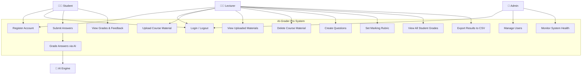
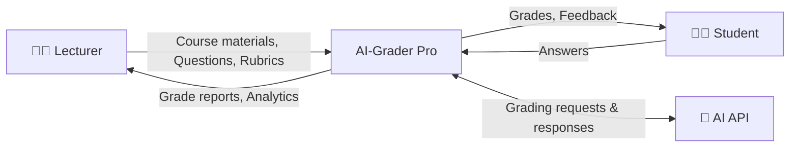
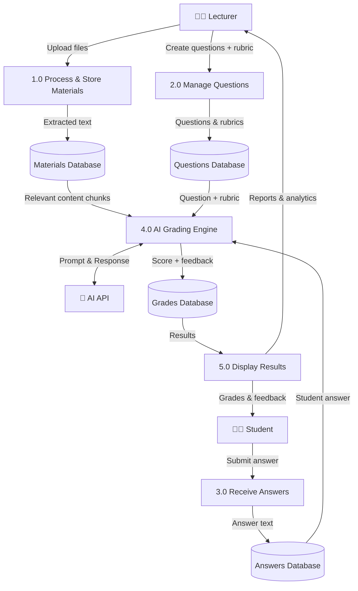
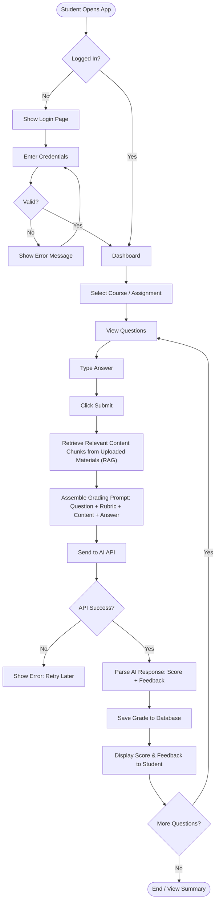
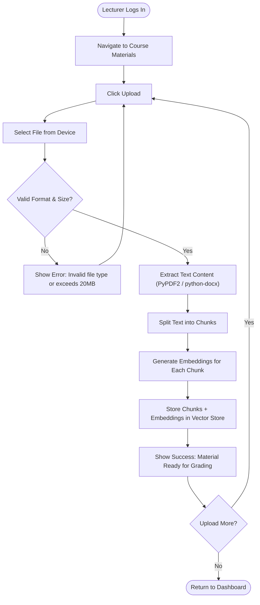

# UML Design Diagrams — AI-Grader Pro

**Version:** 1.0 | **Date:** May 7, 2026

---

## 1. Use Case Diagram

### Use Case Descriptions

| Use Case | Actor(s) | Description |
|----------|----------|-------------|
| UC1 — Register Account | Lecturer, Student | Create a new account with email, password, and role |
| UC2 — Login / Logout | All | Authenticate and manage sessions |
| UC3 — Upload Course Material | Lecturer | Upload PDF, DOCX, or TXT files as grading knowledge base |
| UC4 — View Uploaded Materials | Lecturer | Browse and preview uploaded documents |
| UC5 — Delete Course Material | Lecturer | Remove previously uploaded files |
| UC6 — Create Questions | Lecturer | Write questions linked to uploaded materials |
| UC7 — Set Marking Rubric | Lecturer | Define grading criteria and point allocation |
| UC8 — Submit Answers | Student | Write and submit answers to assigned questions |
| UC9 — Grade Answers via AI | System/AI | AI retrieves relevant content and evaluates the answer |
| UC10 — View Grades & Feedback | Student | See score, AI feedback, and material references |
| UC11 — View All Student Grades | Lecturer | Dashboard of all student results per course |
| UC12 — Export Results | Lecturer | Download grades as CSV |
| UC13 — Manage Users | Admin | Create, edit, disable user accounts |
| UC14 — Monitor System Health | Admin | View logs, API usage, error reports |

---

## 2. Data Flow Diagram (DFD)

### Level 0 — Context Diagram

### Level 1 — Detailed Data Flow

### Data Dictionary

| Data Flow | Description | Format |
|-----------|-------------|--------|
| Course materials | Uploaded lecture notes/textbooks | PDF, DOCX, TXT (≤20MB) |
| Extracted text | Parsed plain text from documents | UTF-8 text chunks |
| Questions | Theoretical questions set by lecturer | Text with point values |
| Rubric | Grading criteria per question | Text guidelines |
| Answers | Student-submitted responses | Free-form text |
| Grading prompt | Assembled prompt with context + answer + rubric | Structured text |
| Score + feedback | AI-generated grade and explanation | JSON (score: 0–100, feedback: text) |

---

## 3. Process Flow Diagram — Grading Workflow

---

## 4. Lecturer Upload Flow

---

*End of UML Diagrams Document*
